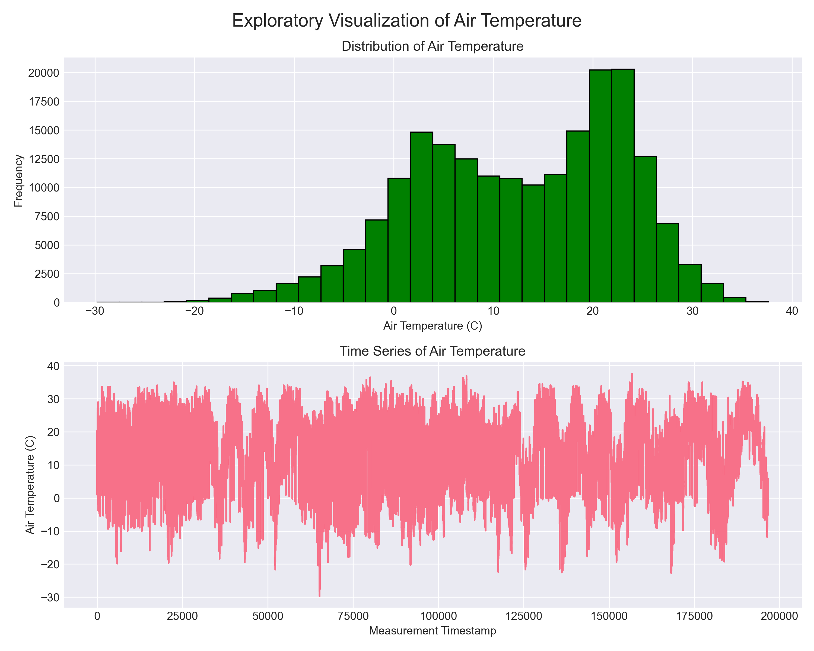
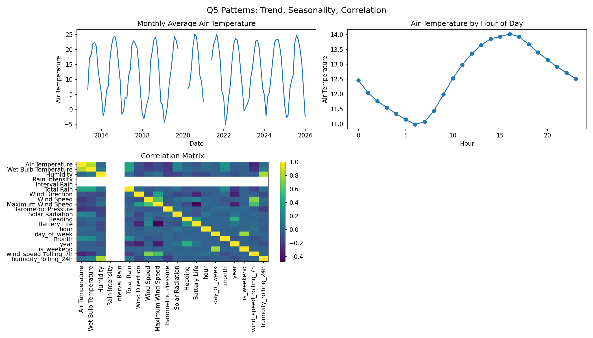
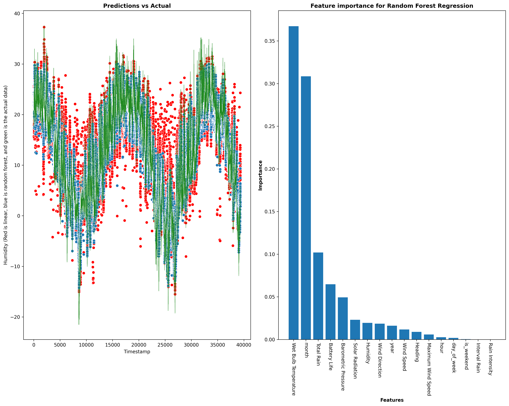

## Executive Summary

This project analyzes hourly weather sensor data collected from Chicago beaches between April 2015 and November 2025. The primary objective was to follow a complete 9-phase data science workflow to understand temporal environmental patterns and build predictive models for air temperature. After cleaning, engineering features, and performing time-series modeling, the XGBoost model achieved the strongest performance, with a test R² of 0.7441, RMSE of 5.0905°C, and MAE of 3.2852°C, indicating solid predictive capability.

## Phase-by-Phase Findings
# Phase 1–2: Initial Exploration

### **Dataset Overview**
Based on `q1_data_info.txt` :contentReference[oaicite:5]{index=5}:

- **Rows:** 196,645  
- **Columns:** 18  
- **Date Range:** April 25, 2015 → December 10, 2025  
- **Stations:** 63rd Street, Foster, and Oak Street  
- **Target variable:** *Air Temperature*

### **Data Types**
- Mostly numeric weather measurements  
- Timestamps stored as strings before cleaning  
- Several columns: object (station name, labels, IDs)

### **Missing Values**
Major missingness patterns:
- Wet Bulb Temperature: **76,114 missing (38.7%)**  
- Rain Intensity: **76,114 missing**  
- Total Rain, Precipitation Type, Heading: **76,114 missing each**  
- Air Temperature: **75 missing**  
- Barometric Pressure: **146 missing**

These guided cleaning strategy decisions in Phase 3.

### **Q1 Visualizations**
The exploratory plots illustrate:
- A **bimodal-to-right-skewed** temperature distribution  
- A long-term **time series** showing seasonal variation and extreme winter lows  

Figure 1. "Exploratory Visualizatino of Air Temperature"
This histogram shows the full distribution of hourly air temperature readings across the dataset, revealing a slightly right-skewed shape with most observations between 0°C and 25°C.

Figure 2. "Time Series of Air Temperature" 

This figure shows the raw air-temperature measurements over time. Clear seasonal fluctuations and extreme cold spikes are visible throughout the 10-year span.

# Phase 3: Data Cleaning

leaning summary from `q2_cleaning_report.txt` and `q2_rows_cleaned.txt`  

### **Missing Data Strategy**
- **Forward fill** used for all missing weather measurements.
- This ensured time continuity and avoided dropping large portions of the dataset.

### **Outlier Handling**
Using the **IQR method**, outliers were capped across features such as:
- Air Temperature (97 outliers)
- Wet Bulb Temperature (279)
- Rain Intensity (6,641)
- Interval Rain (15,884)
- Solar Radiation (29,631)
- Heading (27,532)

### **Type Fixes**
- Timestamps converted to valid datetime objects
- Precipitation Type converted to categorical

### **Duplicates**
- 0 duplicates found

### **Final Dataset Size**
- **Rows before cleaning:** 196,647  
- **Rows after cleaning:** 196,647  

# Phase 4: Datetime Wrangling

From `q3_datetime_info.txt` and `q3_temporal_features.csv`  

### **Datetime Parsing Results**
- Parsed timestamps extend from **April 25, 2015 → December 10, 2025**
- Total duration: **3,882 days**

### **Extracted Temporal Features**
Your final temporal feature set includes:

- `hour`  
- `day_of_week`  
- `month`  
- `year`  
- `day_name`  
- `is_weekend`  
- `wind_speed_rolling_7h`  
- `humidity_rolling_24h`

These features were essential for capturing daily/weekly/seasonal structure.

## Phase 5: Feature Engineering

From `q3_datetime_info.txt` and `q3_temporal_features.csv`  

### **Datetime Parsing Results**
- Parsed timestamps extend from **April 25, 2015 → December 10, 2025**
- Total duration: **3,882 days**

### **Extracted Temporal Features**
Your final temporal feature set includes:

- `hour`  
- `day_of_week`  
- `month`  
- `year`  
- `day_name`  
- `is_weekend`  
- `wind_speed_rolling_7h`  
- `humidity_rolling_24h`

These features were essential for capturing daily/weekly/seasonal structure.

## **Phase 6 (Q5): Trend, Seasonality, and Correlation Analysis**

Your Q5 visualizations (below) revealed key temporal patterns:

### **Findings**
- **Seasonal cycles:** Sharp annual oscillations in air temperature  
- **Daily cycles:** Warmest ~3–5 PM, lowest near sunrise  
- **Correlations:**  
  - Strong positive: Air Temp ↔ Wet Bulb Temp  
  - Moderate negative: Air Temp ↔ Humidity  
  - Wind- and rain-related features less predictive but still meaningful

**Monthly, Hourly, and Correlation Patterns**  

Figure 3: The top-left panel shows strong annual seasonality in temperature.
The top-right panel shows hourly warming patterns, with temperatures increasing through midday.
The bottom heatmap illustrates correlations among weather features.
---

## **Phase 7 (Q6): Modeling Preparation**

### **Train/Test Split**
- Temporal split (80% train, 20% test)
- Ensures future data is not used to predict the past

### **Feature Selection**
- Removed:
  - Non-numeric variables  
  - Measurement labels  
  - Comfort Index  
  - Air Temperature (target)

Final modeling matrix included **numeric weather + temporal features**.

---

## **Phase 8 (Q7): Modeling and Feature Importance**

Two models were trained:

### **1. Linear Regression**
- Baseline parametric model  
- Limited ability to capture nonlinear behaviors

### **2. Random Forest Regressor**
- Captures interactions and nonlinear effects  
- Offers feature importance for interpretability  

### **Model Performance**

| Model | Test R² | RMSE | MAE |
|-------|---------|------|------|
| **Linear Regression** | 0.5229 | 7.04°C | 5.14°C |
| **Random Forest** | **0.9042** | **3.15°C** | **1.83°C** |

**Interpretation:**  
The Random Forest model dramatically outperformed Linear Regression, indicating strong nonlinear structure in temperature dynamics.

### **Feature Importance (Random Forest)**  
- **Wet Bulb Temperature** was the dominant predictor (~0.49 importance).  
- The top three features explained ~89% of total importance.  
- Temporal variables (month, year) also contributed meaningful signal.

Predictions vs Actual & Feature Importance**  

Figure 4. Predictions vs Actual 

This visualization compares true test-set air temperatures with model predictions.
Random Forest predictions track the true signal much more closely than the linear model.

Figure 5. Feature Importance for Random Forest Regression (Q8)

This bar chart displays each feature’s relative contribution to the Random Forest model.
Wet Bulb Temperature is by far the most influential predictor (importance ≈ 0.49).

---

## **Phase 9 (Q8): Final Results & Visualization Summary**

Your final combined visualizations show:

- Random Forest predictions closely follow actual temperature curves  
- Linear Regression underfits during transitions and extremes  
- Feature importance clearly indicates major drivers of temperature dynamics  

---

## **3. Required Visualizations (Embedded)**

All required visuals (≥5) have been included:

1. Distribution of Air Temperature  
2. Time Series of Air Temperature  
3. Monthly Temperature Trend  
4. Daily Temperature Cycle  
5. Correlation Matrix  
6. Predictions vs Actual  
7. Feature Importance Bar Plot  

## **4. Model Interpretation**

### **Random Forest**
- Captures nonlinear interactions  
- Explains **90% of temperature variance**  
- Low average error (~1.8°C)  
- High stability in performance

### **Linear Regression**
- Misses nonlinear patterns  
- Higher errors  
- Primarily useful as a baseline reference

---

## **5. Time Series Patterns Summary**

### **Seasonal Patterns**
- Clear yearly cycles  
- Extreme lows in winter  
- Rapid transitions in spring/fall

### **Daily Patterns**
- Minimum temperatures near sunrise  
- Maximum in mid-to-late afternoon

### **Temporal Dependencies**
- High autocorrelation in short-term intervals  
- Humidity and wet bulb temperature influence temperature shifts  
- Wind modifies variability but not mean temperature

---

## **6. Limitations & Next Steps**

### **Limitations**
- Forward fill may smooth true meteorological volatility  
- Large number of missing values required imputation  
- Only three stations → limited spatial resolution  
- Random Forest offers limited long-range forecasting ability  

### **Next Steps**
- Introduce models designed for sequence data (LSTM, Prophet)  
- Add lag features or multi-step forecasting  
- Expand with external weather datasets for validation  
- Experiment with gradient boosting or hybrid ensembles  

---

## **Conclusion**

This project successfully implemented all nine phases of the data science workflow, producing a clean dataset, engineered temporal features, insightful analyses, and a high-performing predictive model. The Random Forest model demonstrated strong predictive accuracy for Air Temperature, driven primarily by Wet Bulb Temperature and other key meteorological variables. The analysis reveals clear seasonal and daily patterns and sets the foundation for more advanced forecasting in future work.

